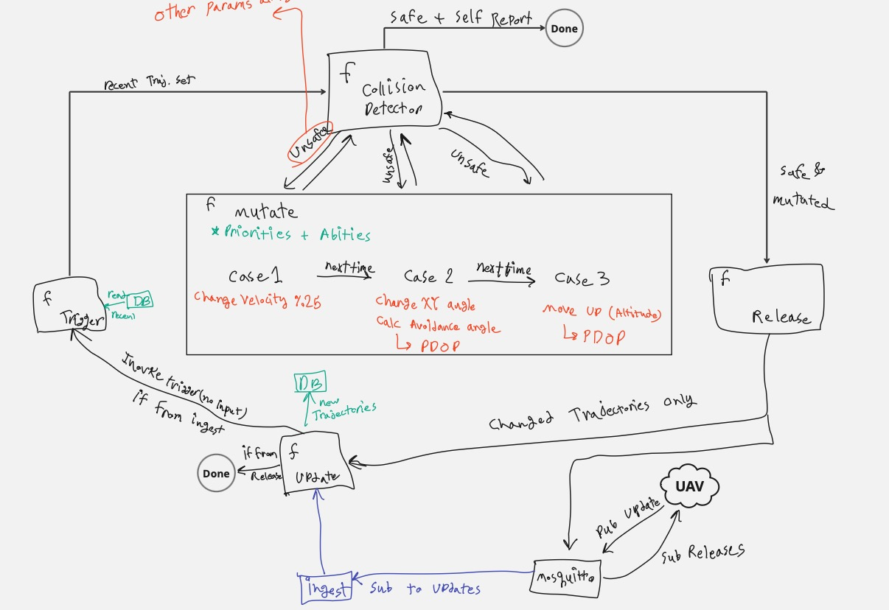
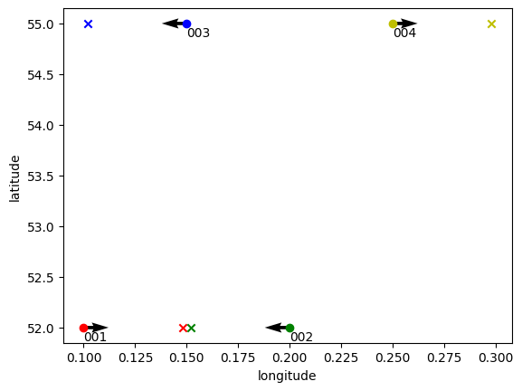
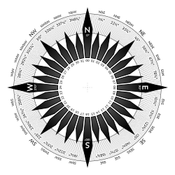

# Anti-Collision System for Drones: Serverless Functions

> **Note:** This is an early prototype of the anti-collision system (and TUB services) and is not ready for production use. The project is currently archived.

This repository contains the serverless functions for the 6gNext anti-collision system for drones. It is designed to be used for the [6gNext project](https://6gnext.de/?page_id=524).

The system is implemented as a serverless function chain, where each function is responsible for a specific task. The functions are written in Python and designed to run on the [tinyFaaS](https://github.com/OpenFogStack/tinyFaaS) platform, a lightweight serverless framework that runs functions in containers.

The functions integrate with Kafka/Mosquitto, MongoDB, and Jaeger for tracing. An [ingester](https://github.com/ChaosRez/6gn-ingester) service receives MAVLink messages from UAVs and triggers the function chain.

## Serverless Architecture



_A sample collision detection scenario:_  


### Data Format

For a sample data format, please refer to the `data.json` file.

The `mutate` function adds a specific key to identify trajectories that are generated by the system and not reported by UAVs:
```json
{"origin":  "mutate"}
```

### Coordinate System

The system uses the compass rose as a reference for directions, where 0 degrees is North.



## Getting Started

Follow these instructions to set up the environment on a Debian-based server.

### Prerequisites

-   `git`
-   `curl`
-   `go` version 1.22.5 or newer

### Get Docker

First, add Docker's official GPG key and set up the repository.

```bash
# Update package index and install prerequisites
sudo apt-get update
sudo apt-get install -y ca-certificates curl

# Add Docker's official GPG key
sudo install -m 0755 -d /etc/apt/keyrings
sudo curl -fsSL https://download.docker.com/linux/debian/gpg -o /etc/apt/keyrings/docker.asc
sudo chmod a+r /etc/apt/keyrings/docker.asc

# Add the Docker repository to Apt sources
echo \
  "deb [arch=$(dpkg --print-architecture) signed-by=/etc/apt/keyrings/docker.asc] https://download.docker.com/linux/debian \
  $(. /etc/os-release && echo "$VERSION_CODENAME") stable" | \
  sudo tee /etc/apt/sources.list.d/docker.list > /dev/null
sudo apt-get update
```

Now, install Docker Engine, CLI, and other required packages.

```bash
sudo apt-get install -y neovim tmux bat htop libavutil-dev make zip docker-ce docker-ce-cli containerd.io docker-buildx-plugin docker-compose-plugin
```

You may need to add your user to the `docker` group to run Docker commands without `sudo`.

```bash
sudo groupadd docker
sudo usermod -aG docker ${USER}
```
Log out and log back in for this change to take effect.

### Get Go

```bash
wget https://go.dev/dl/go1.22.5.linux-amd64.tar.gz
sudo tar -C /usr/local -xzf go1.22.5.linux-amd64.tar.gz
rm go1.22.5.linux-amd64.tar.gz
```

Then, add the following lines to your `~/.profile` and run `source ~/.profile` to apply the changes:

```bash
export PATH=$PATH:/usr/local/go/bin  
export GOPATH=$HOME/go
alias bat="batcat"
```

### Get tinyFaaS

Clone the tinyFaaS repository.

```bash
git clone https://github.com/OpenFogStack/tinyFaaS.git
```

> **Note:** You will need to modify tinyFaaS to support build tools for some Python libraries, as the default function container does not have them. This requires building the wheel in a separate environment.

## Run services
run kafka, jaeger, mongodb, and Ingester vias `docker compose`.
Note that Kafka advertised address should be the public IP of the server.
Also, the '[ingester](https://github.com/ChaosRez/6gn-ingester)' service should be modified to use the public IP of Kafka.
```bash
mkdir 6gn && cd 6gn
nvim docker-compose.yml
docker compose  up -d --build
```

### MQTT QoS
The UAV clients should use a QoS level of 0 for sending updates. But the Release function should use QoS level 1. The release message should be sent with a unique identifier to prevent the UAVs from executing the release command multiple times.

-   UAV clients should send updates with a **QoS level of 0** (at-most-once delivery).
-   The `Release` function, however, should use a **QoS level of 1** (at-least-once delivery) to ensure the command is received. The release message should include a unique identifier to prevent UAVs from executing the same command multiple times.

## Security and Performance Considerations

-   **Security:** The default configurations for MongoDB and Mosquitto are not secure. You should enable authentication and authorization for production environments. The tinyFaaS functions are not intended to be exposed to the public internet.
-   **Performance:** By default, tracing is configured with `sampling.always_on`, which sends all trace samples to Jaeger. This can be costly and should be adjusted for production use by changing the sampling rate or disabling it.

## Running with Simulation

For testing and development purposes, you can use the [Skybed](https://github.com/jan-be/skybed) to simulate multiple UAVs and test the serverless anti-collision system without physical drones.

Skybed allows you to:

- Test the anti-collision system with multiple UAVs (up to 200+ simultaneous drones)
- Simulate various collision scenarios and flight patterns
- Validate function chain performance under load
- Debug the system behavior in controlled conditions


## Copyright Notice

This project is owned by TU Berlin. For any usage, modifications, or distribution, please contact the project maintainer at `mm@3s.tu-berlin.de`. All rights reserved.

This notice must be included in any copy, modification, or distribution of the project's files.
